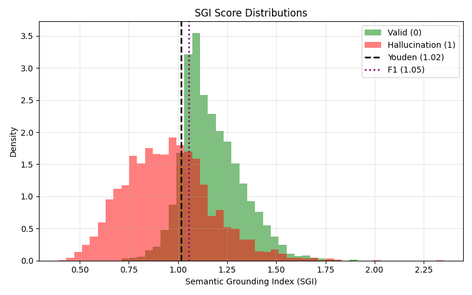
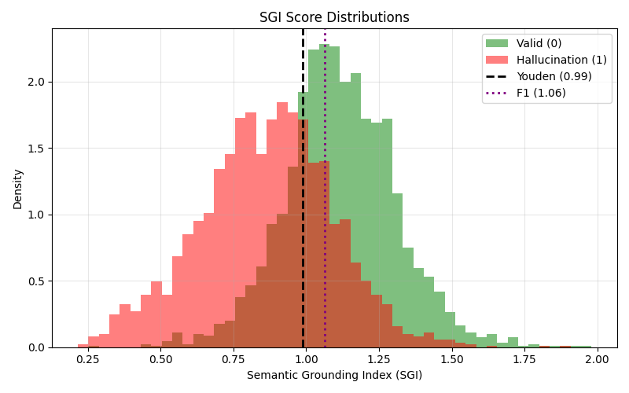

# Semantic Grounding Index (SGI) Evaluation Pipeline

This repository provides a modular, fully automated Python pipeline for detecting hallucinations in Retrieval-Augmented Generation (RAG) systems using the **Semantic Grounding Index (SGI)**. 

This is an implementation of the geometric hallucination detection method introduced in the paper:  
*[Semantic Grounding Index: Geometric Bounds on Context Engagement in RAG Systems](https://arxiv.org/pdf/2512.13771)*.

The SGI metric leverages the "semantic laziness" hypothesis: when an LLM hallucinates, its response remains angularly proximate to the original question rather than successfully departing toward the retrieved context in the embedding space $\mathbb{S}^{d-1}$.

---

## 🚀 Quick Reproducibility

The pipeline is designed for zero-friction setup. **You do not need to manually download any datasets.** The data loaders will automatically fetch the required raw data from Hugging Face or official repositories, unify schemas, and manage caching.

### Option A: Using `uv` (Recommended)
```bash
git clone <repo-link>
cd rag-hallucination-detection
uv sync
uv pip install -e .
uv run scripts/run_experiment.py --config configs/default.yaml
```
### Option B: Traditional `pip` & `venv`
```bash
git clone <repo-link>
cd rag-hallucination-detection
python -m venv .venv
source .venv/bin/activate  # On Windows: .venv\Scripts\activate
pip install -r requirements.txt
pip install -e .
python scripts/run_experiment.py --config configs/default.yaml
```
---

## 🏗️ System Architecture & Design Choices

To ensure the pipeline is future-proof and easily extensible to new models and datasets, the architecture is strictly decoupled into distinct phases:

1. **Dataset Unification (The QRCL Schema):** Raw datasets arrive in countless formats. The `BaseLoader` forces all incoming data into a strict `QRCL` schema (`Question`, `Response`, `Context`, `Label`). New datasets only require writing a short loader subclass.
2. **L2-Normalized Embeddings:** Text fields are embedded using state-of-the-art sentence transformers. Because SGI relies on spherical geometry, embeddings are strictly L2-normalized.
3. **GPU-Accelerated SGI Math:** Batched geodesic distance calculations ($\theta$) are executed directly on the GPU/MPS to handle large datasets efficiently.
4. **Threshold Tuning:** The pipeline automatically identifies the optimal classification boundary separating valid responses from hallucinations using both Youden's J statistic and F1 Score optimization.

### 📂 Project Structure
```text
.
├── configs/
│   └── default.yaml                # YAML configurations for experiments
├── data/
│   ├── raw/                        # Auto-downloaded raw datasets (Git-ignored)
│   ├── qrcl/                       # Unified QRCL format cache
│   └── embedded/                   # Computed embeddings cache
├── images/
│   ├── halueval.png                # Distribution plots
│   └── medhallu.png
├── scripts/
│   └── run_experiment.py           # Main execution script
└── src/
    └── sgi_eval/
        ├── config.py               # Centralized paths and schema definitions
        ├── dataset_loaders/        # Custom loaders (HaluEval, MedHallu, etc.)
        └── pipeline/
            ├── embeddings_generator.py
            ├── sgi.py              # Core geometric math
            ├── threshold_tuner.py
            └── evaluator.py        # Statistical metrics
```
---

## 📊 Experimental Results

### 1. HaluEval (Referential Replication)
We successfully replicated the pipeline on the paper's reference dataset, `HaluEval`. Our results closely match the theoretical and empirical findings of the original authors, confirming that valid responses possess significantly higher SGI scores than hallucinations.

**Evaluation Metrics:**
* **Mean SGI (Valid):** 1.173
* **Mean SGI (Hallucination):** 0.951
* **Effect Size (Cohen's d):** +1.17 *(Paper reported ~1.13 mean across models)*
* **ROC-AUC:** 0.807 *(Paper reported ~0.806 mean across models)*
* **p-value (Welch's t):** 0.00e+00



### 2. MedHallu (Domain Extension)
To test the robustness of the SGI metric, we extended the pipeline to `MedHallu`, a specialized medical domain dataset featuring both human-annotated and artificially generated hallucinations. The geometric separation remains highly stable.

**Evaluation Metrics:**
* **Mean SGI (Valid):** 1.118
* **Mean SGI (Hallucination):** 0.862
* **Effect Size (Cohen's d):** +1.22
* **ROC-AUC:** 0.810
* **p-value (Welch's t):** 0.00e+00



---

## 🤝 Extending the Pipeline

Adding a new dataset requires only two steps:
1. Create a new loader in `src/sgi_eval/dataset_loaders/` that inherits from `BaseLoader`.
2. Map the dataset's specific columns to the `QRCL` schema inside the `transform()` method.

The pipeline will automatically handle the downloading, caching, embedding, math, and evaluation.

---
## 🔮 Future Work & Extensions

The primary goal of this project is to evaluate how well geometric hallucination detection methods generalize across datasets and domains. While the current pipeline successfully implements the baseline SGI method and validates it on `HaluEval` and `MedHallu`, several promising avenues exist for future research and extension:

* **Cross-Domain Transferability Analysis:** The current pipeline tunes thresholds specifically for each dataset. A critical next step is to evaluate *zero-shot transferability*—taking the optimal threshold tuned on a general reference dataset (like `HaluEval`) and applying it directly to medical datasets (like `Med-HALT` or `Med-MMHL`) to observe how the decision boundary holds up across shifting domains.
* **Local LLM Integration:** Currently, the pipeline evaluates pre-computed responses from static datasets. Future extensions could integrate local, open-weight language models to dynamically generate the `Response` field. This would allow us to study how different generator architectures (and subsequent model updates) affect the geometric "semantic laziness" trace.
* **Hybrid Detection Pipelines:** SGI is highly effective at detecting *topical disengagement* but struggles with subtle factual inaccuracies within the same semantic neighborhood (e.g., swapping "hyperglycemia" for "hypoglycemia"). Combining SGI with Natural Language Inference (NLI) methods could create a highly robust, multi-layered detector.
* **Dataset Expansion:** Implementing additional `BaseLoader` subclasses for the remaining candidate datasets (`MedHal`, `Med-HALT`, `Med-MMHL`, and `HalluQuestQA`) will enable a massive, comprehensive meta-analysis of geometric hallucination detection across both organic and adversarially generated data.